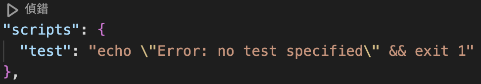
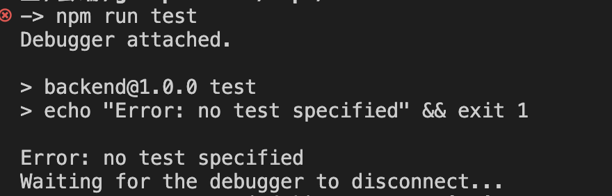

#### 觀察 package.json 的變化
`npm init` 之後他會詢問一連串的問題協助我們建立package.json檔案
接著 `npm install express` 後，在出現了
`"dependencies": {`
    `"express": "^4.21.0"`
  `}`

#### 觀察 node_modules 裡面有什麼
在下載了 `express ` 之後，node_modules 裡面有跑出非常多資料夾，每個資料夾幾乎都會有：README.md,  package.json, CHANGELOG.md, index.js, LICENSE 等等，這都是一個個插件，在這裡可以看到 `/express/package.json` 裡面也有許多 dependencies 所以在我們把 `express` 下載後， `express` 也會拉其他它需要的插件過來下載。

#### package.json 中的 dependencies 與 devDependencies 分別是什麼
dependencies 是會紀錄依賴 (dependent) 使用的插件，使用在已經發佈的版本上
dev 是 develop 的縮寫，所以 devDependencies 是記錄開發版本有使用插件

#### package.json 中的 scripts 這個區塊怎麼用？
scripts 的概念很像 alias 有時候要下的指令會很長，用手打可能會有記不清/打錯/太慢的缺點，所以可以在 scripts 裡面設定想要使用的指令名稱，裡面使用的語言是 Shell script ，而在我們 npm init 之後，會預設一個叫做 test 的 script：

vscode 很方便，可以直接按偵錯來選擇執行 script，或是可以直接打指令來執行
： `npm run test`


#### Port number 要怎麼以環境變數來設定？

可以建立一個 .env 檔案，在.js中設定port的程式碼改成 `const port = process.env.PORT; // 3000` 最後 在執行程式前加上 `--env-file=.env`，如 `node --env-file=.env app.js` 就可以使用環境變數設定。[官網教學](https://nodejs.org/en/learn/command-line/how-to-read-environment-variables-from-nodejs)


#### 關於哪些檔案應該要被放上 github repo 這個問題，描述看看為什麼你選擇上傳某些檔案、選擇不上傳某些檔案，決策的要素是什麼？
我認為上傳的檔案需要以最精簡能夠執行的形式上傳到github
不上傳的檔案會有幾類：日誌 log,  cache, 環境變數, testing file 等等

我使用 gitignore generator 參考了一下：
出現了非常多需要 ignore 的檔案：
大致上可以分類成幾種：
   1. *.log：幾乎不影響執行，只有記錄執行歷程的功能
   2. cache：執行中產生的 cache，也不會因為這個而不能執行
   3. environment variable：隱私問題不能上傳
   4. 另外看到node_modules/也需要 ignore 雖然不上傳就代表沒有插件了，不過其實在 package.json 都有記錄 dependency 所以也可以不需要上傳，可以依靠這個得知需要的插件，而且如果一個專案裝了非常多插件node_modules/ 也上傳上去，就會變得很肥，也浪費不必要的空間
   5. 其他套件會產生的記錄： yarn, Gatsby, VSCode, SvelteKit ... 
```
# Created by https://www.toptal.com/developers/gitignore/api/node
# Edit at https://www.toptal.com/developers/gitignore?templates=node

### Node ###
# Logs
logs
*.log
npm-debug.log*
yarn-debug.log*
yarn-error.log*
lerna-debug.log*
.pnpm-debug.log*

# Diagnostic reports (https://nodejs.org/api/report.html)
report.[0-9]*.[0-9]*.[0-9]*.[0-9]*.json

# Runtime data
pids
*.pid
*.seed
*.pid.lock

# Directory for instrumented libs generated by jscoverage/JSCover
lib-cov

# Coverage directory used by tools like istanbul
coverage
*.lcov

# nyc test coverage
.nyc_output

# Grunt intermediate storage (https://gruntjs.com/creating-plugins#storing-task-files)
.grunt

# Bower dependency directory (https://bower.io/)
bower_components

# node-waf configuration
.lock-wscript

# Compiled binary addons (https://nodejs.org/api/addons.html)
build/Release

# Dependency directories
node_modules/
jspm_packages/

# Snowpack dependency directory (https://snowpack.dev/)
web_modules/

# TypeScript cache
*.tsbuildinfo

# Optional npm cache directory
.npm

# Optional eslint cache
.eslintcache

# Optional stylelint cache
.stylelintcache

# Microbundle cache
.rpt2_cache/
.rts2_cache_cjs/
.rts2_cache_es/
.rts2_cache_umd/

# Optional REPL history
.node_repl_history

# Output of 'npm pack'
*.tgz

# Yarn Integrity file
.yarn-integrity

# dotenv environment variable files
.env
.env.development.local
.env.test.local
.env.production.local
.env.local

# parcel-bundler cache (https://parceljs.org/)
.cache
.parcel-cache

# Next.js build output
.next
out

# Nuxt.js build / generate output
.nuxt
dist

# Gatsby files
.cache/
# Comment in the public line in if your project uses Gatsby and not Next.js
# https://nextjs.org/blog/next-9-1#public-directory-support
# public

# vuepress build output
.vuepress/dist

# vuepress v2.x temp and cache directory
.temp

# Docusaurus cache and generated files
.docusaurus

# Serverless directories
.serverless/

# FuseBox cache
.fusebox/

# DynamoDB Local files
.dynamodb/

# TernJS port file
.tern-port

# Stores VSCode versions used for testing VSCode extensions
.vscode-test

# yarn v2
.yarn/cache
.yarn/unplugged
.yarn/build-state.yml
.yarn/install-state.gz
.pnp.*

### Node Patch ###
# Serverless Webpack directories
.webpack/

# Optional stylelint cache

# SvelteKit build / generate output
.svelte-kit

# End of https://www.toptal.com/developers/gitignore/api/node
```
[source](https://www.toptal.com/developers/gitignore/api/node)


#### 範例程式中用 require，但上週的 Stack 是用 import/export，這兩種分別是 JavaScript 引用模組的兩種方式: CJS vs ESM，這兩者分別怎麼用？

CJS 是 commonJS Modules
**Import**

ESM 是 ECMAScript Modules (ES6 Modules)

|        | CJS                                                                                                         | ESM                                                                                                   |
| ------ | ----------------------------------------------------------------------------------------------------------- | ----------------------------------------------------------------------------------------------------- |
| 全名     | commonJS Modules                                                                                            | ECMAScript Modules (ES6 Modules)                                                                      |
| 副檔名    | .cjs                                                                                                        | .mjs                                                                                                  |
| Import | 使用 `require` 來import，如 `app.js` 中的`const express = require('express');`                                     | 使用 `import` 來 import，如`week2/main.js` 中的 `import Stack from './stack.js';` 和 python 的語法很類似            |
| Export | 使用 `module.export` 或是 `export` 直接 export後面接上 function, class等，如 `module.exports = func tion(){ ...};`<br> ` | 使用 `export` 來 export 後面接上 function, class等，如 `week2/stack.js` 中的 `export default class Stack { ... }` |
|        |                                                                                                             | 在`package.json`裡面有`"type": "module"`                                                                  |
### 進階題:

#### [localhost](http://localhost) 是什麼？
localhost 是一個主機名稱，IP是 127.0.0.1 也就是會連到自己的電腦，後面會接上port number

#### `curl` 是什麼？查查看怎麼用 curl 來測試網路連線？常用參數有哪些？
Curl 是一個[開源專案](https://github.com/curl/curl) 上用來透過 HTTP Protocol（HTTP HyperText Transfer Protocol 定義存取網路資源的協定，讓我們可以使用 client / server 模式來取得網路資源）下載和上傳檔案的指令

常用參數：
`-L / --location` : 如果HTTP 重新定位(301/302 redirect) curl 也會跟著他  
`--remote-name` : 下載檔案,保留遠端檔案的檔名  
`--dump-header <file>` : 把header資訊寫入到file中  
`--cert <憑證:密碼>`, `--cert-type <憑證的類型>` : 如果需要憑證與密碼  
`--verbose` : 吐出更多訊息分辨 debug 用  
`--data <資料或 json 等>` :   附加檔案用
`-X或--request [GET|POST|PUT|DELETE|PATCH]`  使用指定的 http method 來發出 http request  

**[tldr](https://github.com/tldr-pages/tldr)提供的範例curl指令**
```
- Make an HTTP GET request and dump the contents in `stdout`:
    curl https://example.com

- Make an HTTP GET request, fo[L]low any `3xx` redirects, and [D]ump the reply headers and contents to `stdout`:
    curl --location --dump-header - https://example.com

- Download a file, saving the [O]utput under the filename indicated by the URL:
    curl --remote-name https://example.com/filename.zip

- Send form-encoded [d]ata (POST request of type `application/x-www-form-urlencoded`). Use `--data @file_name` or `--data @'-'` to read from `stdin`:
    curl -X POST --data 'name=bob' http://example.com/form

- Send a request with an extra header, using a custom HTTP method and over a pro[x]y (such as BurpSuite), ignoring insecure self-signed certificates:
    curl -k --proxy http://127.0.0.1:8080 --header 'Authorization: Bearer token' --request GET|PUT|POST|DELETE|PATCH|... https://example.com

- Send data in JSON format, specifying the appropriate Content-Type [H]eader:
    curl --data '{"name":"bob"}' --header 'Content-Type: application/json' http://example.com/users/1234

- Pass client certificate and key for a resource, skipping certificate validation:
    curl --cert client.pem --key key.pem --insecure https://example.com

- Resolve a hostname to a custom IP address, with [v]erbose output (similar to editing the `/etc/hosts` file for custom DNS resolution):
    curl --verbose --resolve example.com:80:127.0.0.1 http://example.com
```