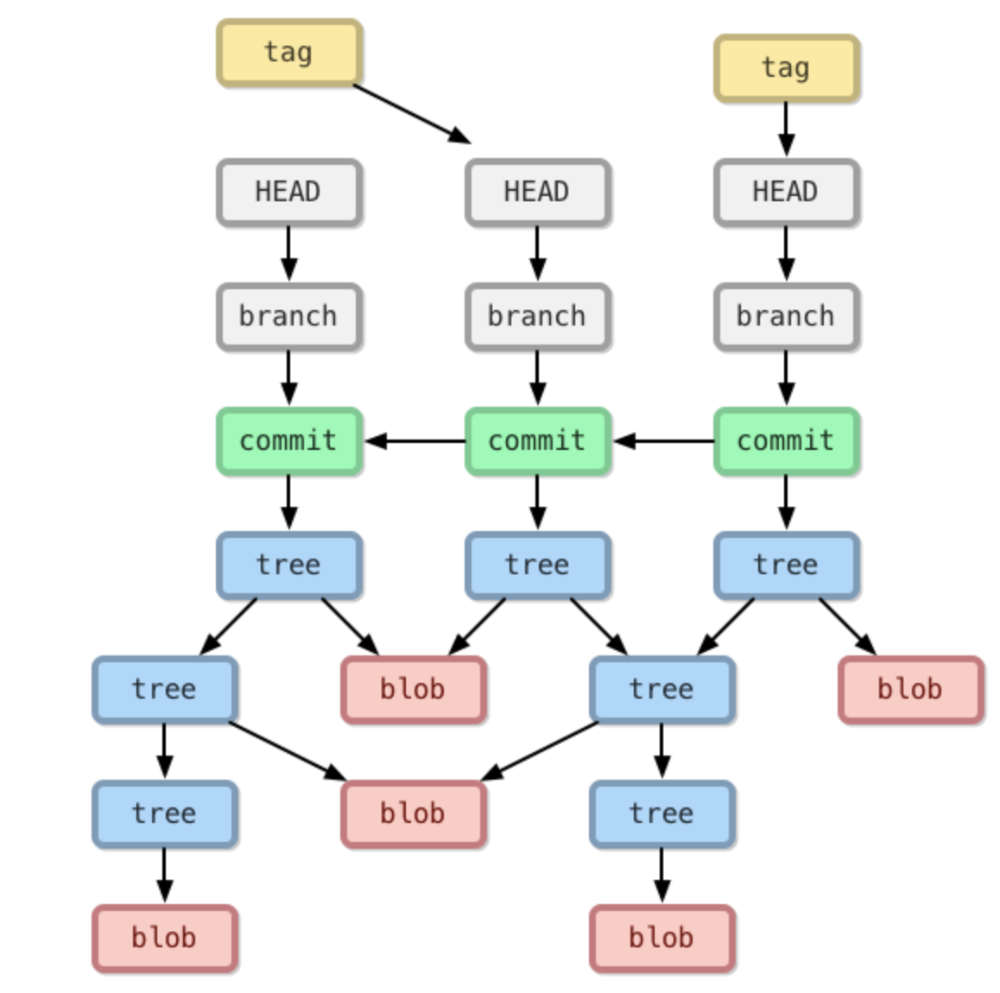

##  說明 blob, tree, commit, branch, head 分別是什麼
### 1. blob  
blob 是 binary large object的縮寫
就是紀錄工作目錄中某個檔案的內容(只儲存內容)
它以文件的 SHA-1 哈希作為標識，因此相同的文件內容只會存儲一次
每次git add 時會產生一個blob

### 2. tree  
儲存特定目錄下的所有資訊，包含該目錄下的檔名、對應的 blob 物件名稱、檔案連結(symbolic link) 或其他 tree 物件等等

### 3. commit  
一個pointer指到tree也可以指到另一個commit
作用是用來記錄有哪些 tree 物件包含在版本中，一個 commit 物件代表著 Git 的一次提交
還會記錄特定提交版本有哪些：tree 物件、以及版本提交的時間、紀錄訊息等等

### 4. branch  
branch 是一個pointer 指向commit 可以用來控制commit

### 5. head  
head 用來幫助git知道我現在的branch在哪，也是一個pointer，指到現在的branch
git checkout 就是改變head指到的branch

## 紀錄在 git repo 操作過程中，.git 檔案夾裡的變化，看看你可以觀察到什麼？
在操作過程中發現在git add, git commit 的時候，在./git/object裡面會多出一個資料夾以及裡面一個檔案；git add 一個檔案時會在./git/object 多出一個 以SHA-1命名的一組資料夾跟檔案，他們的名字合起來後再丟到git cat-file -t 時發現他是一個blob，而在git commit 時會多出一個commit的檔案，也是以SHA-1命名的一組資料夾跟檔案的形式作儲存，同時也多了一個tree

git commit 之後在.git/ref/heads 裡面多出一個main裡面記錄這一個commit，另外在.git/HEAD檔案內紀錄著：ref: refs/heads/main。

也可以應證：HEAD會指向branch然後指向commit

[https://github.com/doggy8088/Learn-Git-in-30-days/blob/master/zh-tw/figures/06/04.png]

接著我多加了一個branch 叫做br2，switch到br2，而refs/heads/多了一個br2的檔案，裡面記錄的檔案竟是跟main一樣的commit，推測是因為還沒commit過所以指向與main分支一樣的方向，
在新增檔案後，於br2 git add 與commit ，裡面記錄的內容變成了新的了，且在.git/HEAD記錄的內容也變成了refs/heads/br2

此外使用git cat-file -p 可以直接查詢以SHA-1命名的一組資料夾跟檔案裡面的內容是什麼：  
blob:某個檔案的內容  
tree: <file_mode> <指向的blob或是tree等等其他> <該檔案名稱>  
commit: 該commit指向的tree的SHA-1 ，commit的parent，誰commit的，commit人建立的檔案  

所以只要把這些git cat-file -p 查詢到的串連起來，便可以畫出像是上圖的效果
##  commit message 應該怎麼寫比較好？應該有什麼 `style` 嗎？
不要空白，也不要寫太長，註新增、刪除、修改檔案，也要說這次commit改變了什麼功能，還有什麼問題還沒解決
commit message 的屬性，像是這次commit 是在做test , add , fix , hotfix 等等可以先一目瞭然知道這次commit在做什麼
