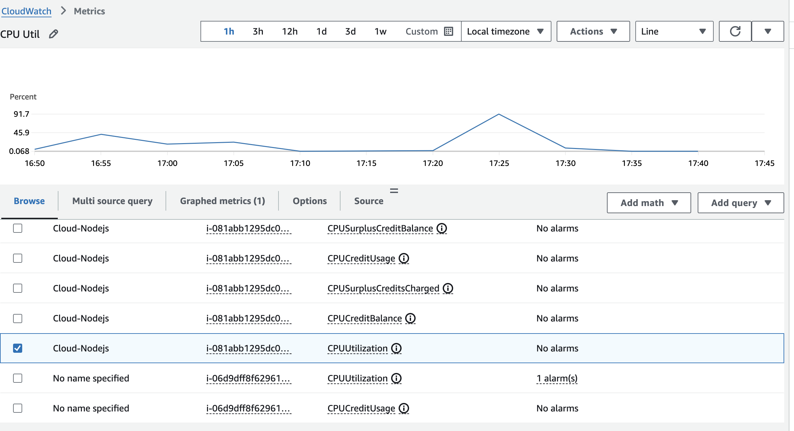
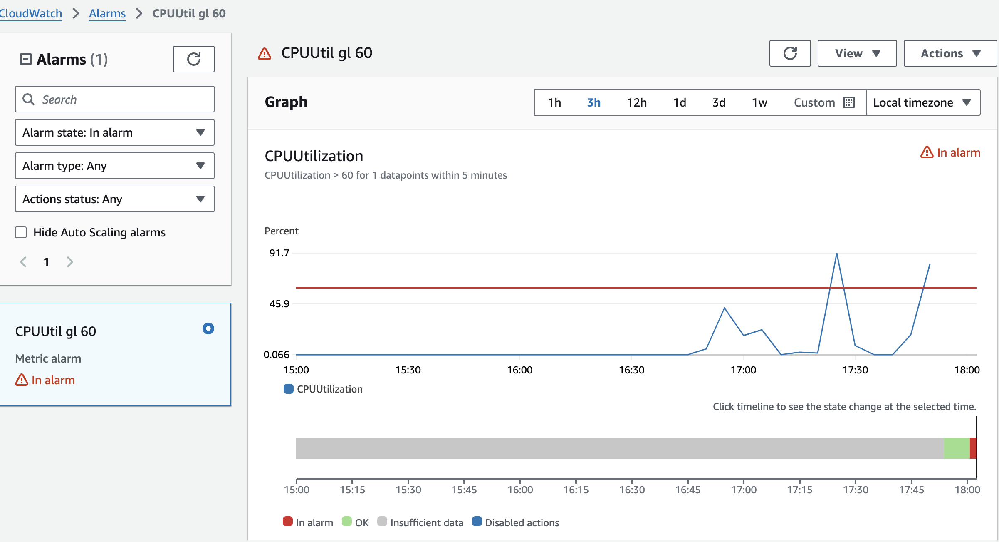
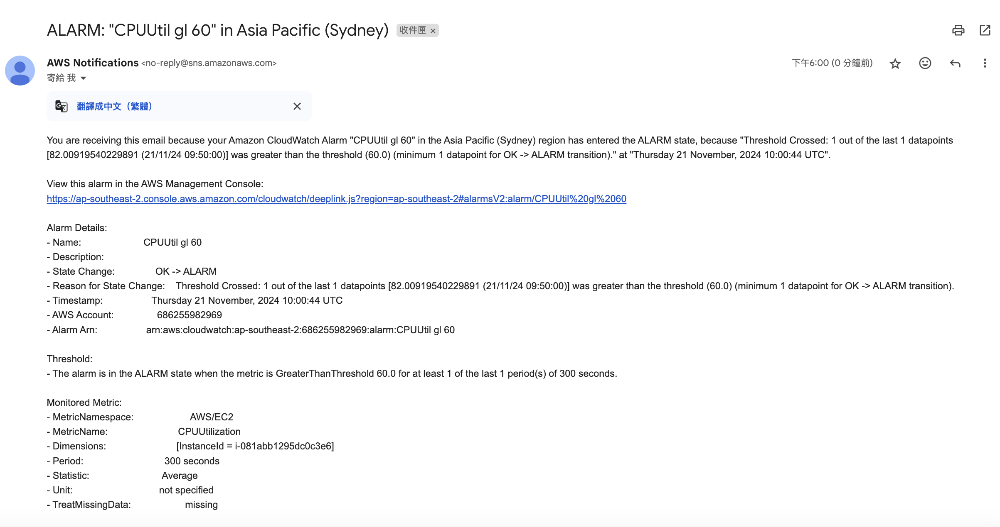

- [X] AWS CloudWatch Metrics - CPUUtilization 的截圖  
- [X] AWS CloudWatch Alarm 圖表的截圖    
- [X] 收到通知的截圖      
- [ ] 進階題      


# AWS CloudWatch Metrics - CPUUtilization 的截圖  
      
# AWS CloudWatch Alarm 圖表的截圖     
      
# 收到通知的截圖      
      


## stress-ng 使用：

### 安裝
```bash
sudo apt update
sudo apt install stress-ng
```

### 參數
- --cpu N                 start N workers that perform CPU only loading
  - 開多少個 Process 給 CPU 跑
- --cpu-load P            load CPU by P %, 0=sleep, 100=full load (see -c)
  - 限制 CPU 跑到多少%
- --timeout T             timeout after T seconds
  - 限制跑的秒數
- --matrix N              start N workers exercising matrix operations
  - 用矩陣計算來拉高 CPU 使用率

### 

