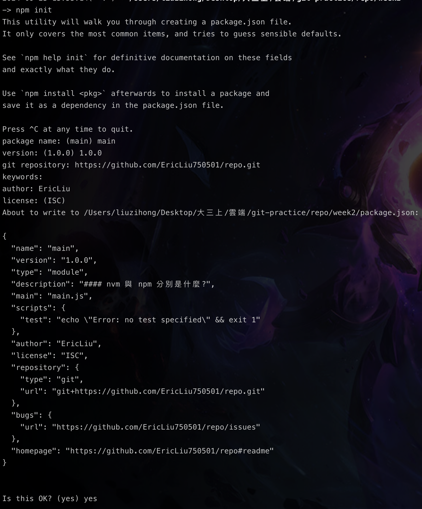
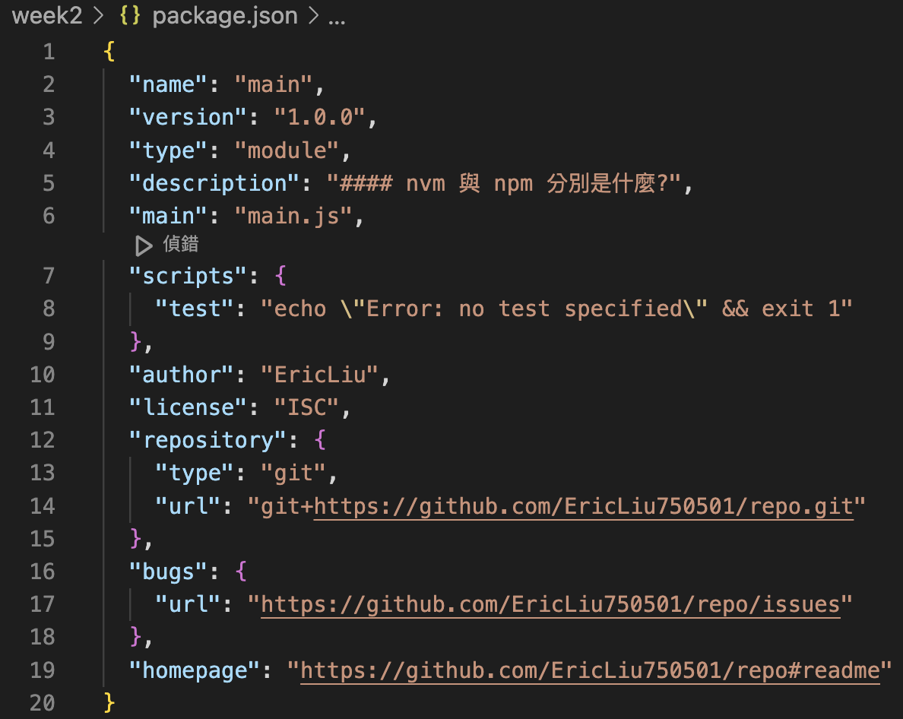

#### Version:  Node.js v20.12.0.

#### nvm 與 npm 分別是什麼?


|     | NVM                                                                                                                                                                                                                                                                                                                                                                                                                                                                                                                                                                                                                                                                                                                                                                                                  | NPM                                                                                                                                                                                                                                                                                                                                                                                                                                                                                |
| --- | ---------------------------------------------------------------------------------------------------------------------------------------------------------------------------------------------------------------------------------------------------------------------------------------------------------------------------------------------------------------------------------------------------------------------------------------------------------------------------------------------------------------------------------------------------------------------------------------------------------------------------------------------------------------------------------------------------------------------------------------------------------------------------------------------------- | ---------------------------------------------------------------------------------------------------------------------------------------------------------------------------------------------------------------------------------------------------------------------------------------------------------------------------------------------------------------------------------------------------------------------------------------------------------------------------------- |
| 全稱  | Node Version Manager                                                                                                                                                                                                                                                                                                                                                                                                                                                                                                                                                                                                                                                                                                                                                                                 | Node Package Manager                                                                                                                                                                                                                                                                                                                                                                                                                                                               |
| 說明  | 不同專案下使用的node版本可能不同,所以可以透過nvm來切換Node.js的版本來符合版本需求                                                                                                                                                                                                                                                                                                                                                                                                                                                                                                                                                                                                                                                                                                                                                     | 管理Node.js 中專案會使用的套件                                                                                                                                                                                                                                                                                                                                                                                                                                                                |
| 指令  | **nvm之安裝**：<br>首先在terminal 打下指令安裝nvm<br><br>```curl -o https://raw.githubusercontent.com/nvm-sh/nvm/v0.40.1/install.sh \| bash```<br><br>接下來會有~/.nvm的檔案接著輸入<br>```export NVM_DIR="$([ -z "${XDG_CONFIG_HOME-}" ] && printf %s "${HOME}/.nvm" \|\| printf %s "${XDG_CONFIG_HOME}/nvm")"<br>[ -s "$NVM_DIR/nvm.sh" ] && \. "$NVM_DIR/nvm.sh" # This loads nvm```<br><br>nvm就下載完成了<br>參考：(https://github.com/nvm-sh/nvm)<br><br>**nvm install :**<br>`nvm install 20.17.0` 表示安裝node.js v20.17.0<br><br>**nvm ls-remote:**<br>如果不知道有哪些版本可以使用`nvm ls-remote` 來了解（偶數版本較為穩定）<br><br>**nvm list:**<br>`nvm list` 或是 `nvm ls` 可以列出現在有什麼版本可用：現在我有v20.17.0與v22.9.0<br><br><br>**nvm use:**<br>`nvm use 20.17.0` 切換node版本為v20.17.0<br><br>**nvm current**:<br>`nvm current` 可以查看現在的版本，或是可以使用`node -v` | **npm init:** <br>`npm init` 之後他會詢問一連串的問題協助我們建立package.json檔案<br><br><br>**Package.json:**<br><br><br><br><br><br>**npm install** :<br>`npm install <package>`  會下載 package 以及 dependency<br><br>例如：`npm install vue` : 會多出一個資料夾node_modules存放套件，package.json裡面也會增加幾行敘述：<br><br>`"dependencies": {`<br>    `"vue": "^3.5.8"`<br>  `}`<br><br><br><br>另外會多出一個檔案：package-lock.json<br>內容會有很長的code<br><br>內容是描述了下載的dependency tree |
|     |                                                                                                                                                                                                                                                                                                                                                                                                                                                                                                                                                                                                                                                                                                                                                                                                      |                                                                                                                                                                                                                                                                                                                                                                                                                                                                                    |
