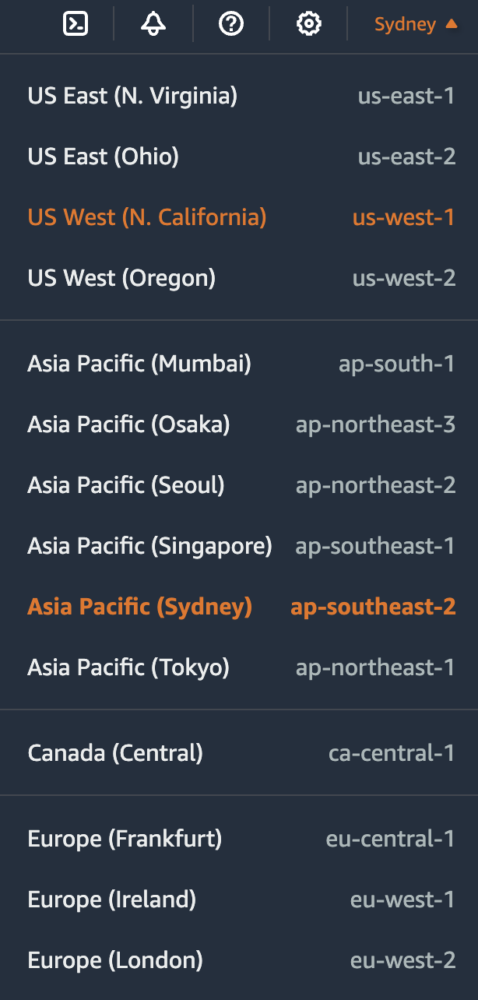
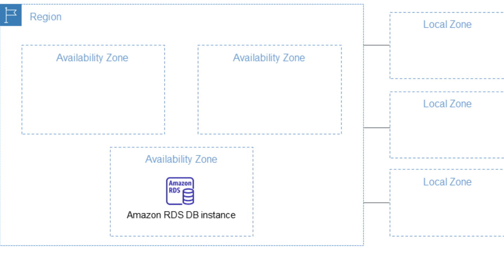
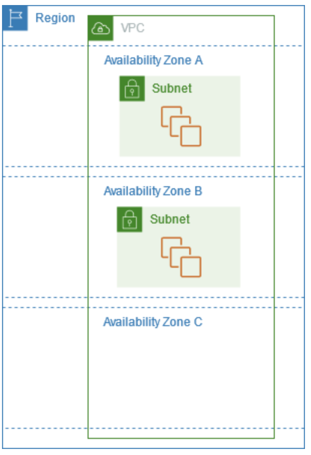

*TODO:*
- [x] Readme 
- [x] callback
- [ ] promise
- [x] express
- [x] group

#### 什麼是 AWS Region, AZ (availability zones)

一個aws帳號可以有很多Region，每個Region皆設計為與其他區域隔離。如此可達到最高的容錯能力與穩定性。
    

| 在這張圖可以看到很多Region，代表不同的地區，以及他們右邊的代號 |  |
| ----------------- | ---------------------- |

Region 與 AZ (availability zones) 的關係如下：  
 [source](https://docs.aws.amazon.com/AmazonRDS/latest/UserGuide/Concepts.RegionsAndAvailabilityZones.html)

每個 Region 擁有多個隔離位置，稱為 AZ(availability zones) 。 AZ code 會是 Region code後續跟著一個字母識別符號。例如：us-east-1**a**。每個 AZ 裡面都會有一個 instance。

另外Local Zone: AWS 會選擇與 User 端相鄰的地理區域，目的是為了減少延遲，滿足要求：遵守醫療保健、金融服務、網路博彩和政府等行業的州和地方資料駐留要求。

 [source](https://docs.aws.amazon.com/AWSEC2/latest/UserGuide/using-regions-availability-zones.html#concepts-regions)

啟動執行 instance 時，會需要選取 Region 和 VPC(Virtual Private Cloud) ，然後從其中一個 AZ 選取 subnet ，或讓 Amazon 自己選。如果其中一個 instance 故障了，可以讓其他 AZ 的 instance 來支援。

下圖說明多個 AZ 在 AWS Region。AZ A 和AZ B 各有一個 subnet ，每個 subnet 都有 instance 。AZ C 沒有 subnet ，因此無法在AZ C中啟動執行 instance 。

#### 如果你要使用 AWS 服務，你會怎麼選擇用哪個 Region，考慮的因素有哪些？

考慮到：
 1. User: 主要的使用者在哪個地區。  
 2. Cost: 不同地區的 aws region 價格不一樣，因為各區域的資源定價因土地、光纖設施、電力和稅賦等因素而有所差異，所以成本也是一個因素。
 3. Service: 如果有新推出的服務，不一定會馬上讓全部的 Region 使用，所以需要注意想要使用的 Service 能不能在自己所選的 Region 使用。
 4. Law: 有些資料會有地方資料駐留要求，如醫療保健、金融服務，不能選擇在海外

目前 AWS 給我默認的是 Asia Pacific (Sydney) 如果沒有其他特殊要求我會選這個，不過 2025 後會有Asia Pacific (Taipei) 或許之後會選擇台灣的
