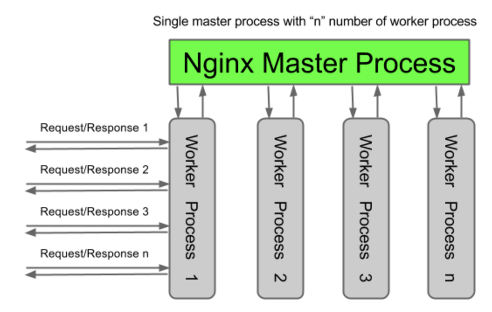
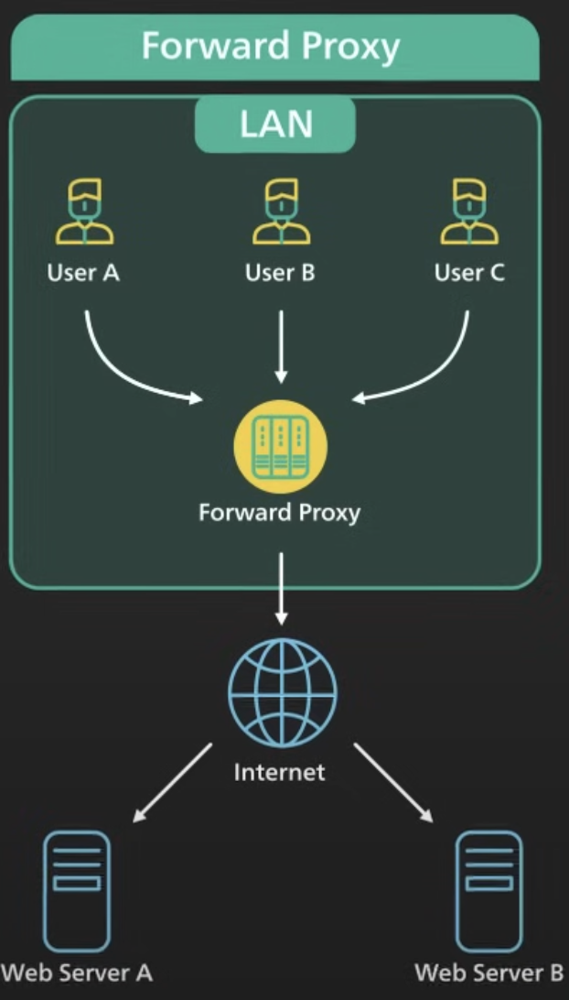
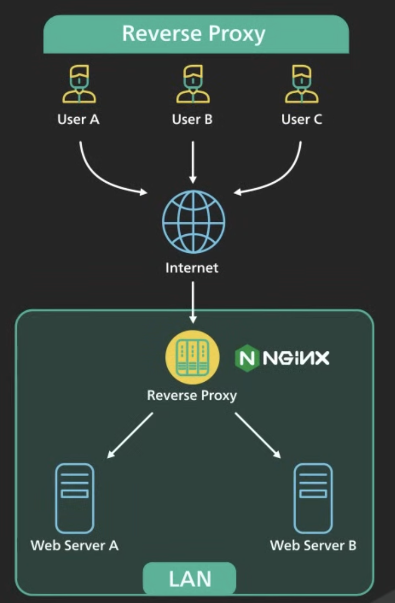
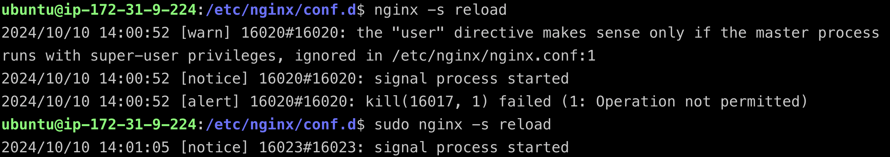

**1. 在 Readme 中提供 instance 的 public IP，我會連線過去檢查，所以要保持主機是一直在啟動中**  
[http://3.106.200.164/](http://3.106.200.164/)  
 
**2. 什麼是 instance type?**  
instance type 是執行 instance 時所使用的主機硬體

我們使用的[*t2.micro*](https://instances.vantage.sh/aws/ec2/t2.micro?region=ap-southeast-2&os=linux&cost_duration=monthly&reserved_term=Standard.noUpfront)的硬體： 
|Compute|	Value|
|-|-|
|vCPUs	|1|
|Memory (GiB)|	1.0|
|Physical Processor|	Intel Xeon Family|
|Memory per vCPU (GiB)	|1.0|
|Clock Speed (GHz)|	3.3|
|CPU Architecture	|i386|
|GPU|	0|
|GPU Architecture|	None|
|Video Memory (GiB)|	0|
|GPU Compute Capability |	0|
|FPGA	|0

**3. 什麼是 Nginx？有哪些用途與特性？**  
NGINX (pronounced "engine x" or "en-jin-eks") 是一個非同步框架的 Web server ，有高效率、高穩定性的特性，常用做  
    1.   反向代理伺服器 ( reverse proxy )  
    2.   負載平衡器 ( load balancer )  
    3.   HTTP內容快取 ( content cache )   
    4.   TCP/UDP 代理伺服器  ( proxy server )  
    5.   郵件代理伺服器  ( mail proxy server )
   
 <a href="https://nginx.org/en/">參考資料</a> 

非同步與同步：[參考資料](https://www.thegeekstuff.com/2013/11/nginx-vs-apache/)
-  同步：對於每個 client ，都有一個完全獨立的 thread 專為他服務， thread 結束後才會釋放資源 (CPU, Memory)，所以一旦 client 變多，沒有相應的資源很容易導致網站卡住 (I/O blocking problems)
- 非同步：用多進程(process)單線程(thread)分配 request 利於動態分配和釋放資源，所以只要高效的循環處理數千個 request 便可以用更少的記憶體完成相同的工作
   - 下圖是 Nginx 處理 request 的流程
    

**4. pm2 套件是什麼？有什麼用處？**   
    **a. 如果不是使用 pm2，那就告訴我你是用哪一個、這個工具的用途，以及，你為什麼這樣選擇**  
    pm 是 process manage 的縮寫，所以 pm2 是用來管理 process 的，能夠簡化常見的系統管理任務，如如性能監控、自動重啟、負載均衡等。如果不用pm2也可以使用:
- forever, Supervisor:輕巧簡便，功能少
- Nodemon:開發環境適用
- StrongLoop Process Manager:高功能，很複雜
- Docker + Docker Compose:要熟docker

**5. 步驟 9 中提到的 `proxy` 是什麼意思？為什麼要透過 Nginx 來 `proxy` 到 Express 開發的 Web Server?**   
    **a. 提示 `Reverse proxy` vs `Forward Proxy`**

proxy 是代理的意思，是一種網路服務，允許一個終端（一般為 client ）通過這個服務與另一個終端（一般為 server ）進行非直接的連接
如[圖](https://zh.wikipedia.org/zh-tw/%E4%BB%A3%E7%90%86%E6%9C%8D%E5%8A%A1%E5%99%A8#/media/File:Schematic_Proxy_Server.svg)中間橘色的電腦代表 proxy 的角色
   
在步驟9中，我們透過 nginx 讓 aws 的 ip 可以 proxy 到 express web server 的 `localhost:3000`
而 proxy 分成 Reverse proxy 與 Forward Proxy 兩種
|Forward Proxy|Reverse proxy|
|------|------|
|||

Forward Proxy 好處：
- 保護 client 端的隱私 (ip 被 proxy 保護)
- 限制特定內容存取，保護 client 端安全

Reverse proxy：
- 保護 sever 端隱私 (ip 被 proxy 保護，不易被DDoS攻擊)
- 負載平衡：proxy 背後可以有很多台 server 流量大時可以利用 proxy 分配主機
- Cache：如果短期間有相同的 request ， proxy 就可以用 主機的 cache 提升效率

所以透過 Nginx 的 reverse proxy 連到我們的 sever 有安全，效率等的好處

[Source](https://www.youtube.com/watch?v=4NB0NDtOwIQ)  
**6. 在 readme 中提供步驟 9 的 Nginx 設定檔**  
[Nginx 設定檔](assets/nodeApp)
利用 scp 直接從上面拉過來

**7. Security Group 是什麼？用途為何？有什麼設定原則嗎？**  

security group 控制可以連進來的人，所以 Security Group: Inbound 22 & 80 port 的意思是控制只有透過port 22 (SSH)和 port 80 (HTTP) 的方式連線才能連進來，是一種防火牆的概念

**8. 什麼是 sudo? 為什麼有的時候需要加上 sudo，有時候不用？**  

sudo 的 su 是 super user 的意思，可以讓使用者以安全的方式使用特定的權限執行程式
在做作業時，我發現會需要加上 sudo 的情況大多是會經歷修改檔案的時候需要，或是執行特定指令需要
 從`ls -l` 來看一般 user 沒有權限  
 不用 sudo 就會 not permitted

**9. Nginx 的 Log 檔案在哪裡？你怎麼找到的？怎麼看 Nginx 的 Log？**  
透過Nginx官網得知 Nginx 的 Log file 在 var/log/nginx/裡面，Nginx 的 log 可以自訂格式，但有預設的格式：
`'$remote_addr - $remote_user [$time_local] ' '“$request”$status $body_bytes_sent' '“$http_referer”“$http_user_agent”';`

從 access log 取出一條來看：
`140.119.235.6 - - [14/Oct/2024:05:15:52 +0000] "GET / HTTP/1.1" 304 0 "-" "Mozilla/5.0 (Macintosh; Intel Mac OS X 10_15_7) AppleWebKit/537.36 (KHTML, like Gecko) Chrome/127.0.0.0 Safari/537.36    "`

- `$remote_addr` = `140.119.235.6`    
- `$remote_user` = `-`    
- `[$time_local]` = `[14/Oct/2024:05:15:52 +0000]`    
- `“$request” $status $body_bytes_sent` = `"GET / HTTP/1.1" 304 0 "-"`    
- `"$http_referer”` = `"-"`
- `“$http_user_agent”` = `"Mozilla/5.0 (Macintosh; Intel Mac OS X 10_15_7) AppleWebKit/537.36 (KHTML, like Gecko) Chrome/127.0.0.0 Safari/537.36`

**10.  其他你在過程中遭遇的問題，有找到解答就記錄下來，沒有可以把問題放著，下次上課討論。如果沒有遇到任何問題，也可以回答「無」**  
*主要時間花比較多的問題：*  
步驟1, 2  
Q1. `ssh -i /path/key-pair-name.pem instance-user-name@instance-public-dns-name` 連不上去  
A1. 在這個環節對於security group 不太熟悉，不確定是 group 設錯還是其他，查了 ip ，建立 instance 的資料，最後發現是 .pem 權限不夠  

步驟4, 5  
Q2. 不知道要如何啟動nginx  
A2. `systemctl` 以及 `service` 指令有很大的用處  

步驟9  
Q3. proxy 到 Express Server  
A3.  
- 首先查了要怎麼改 nginx -> `/etc/nginx` 裡面
- 需要改哪裡？ -> `/etc/nginx/sites-enabled`
- 怎麼改？ -> 裡面有個 default 檔案可以參考，配合[官方文檔新手教學](https://nginx.org/en/docs/beginners_guide.html)服用，出現    error 直接喂 google
- 改了 config 沒有 proxy 到 express server -> 因為 listen 80 和 default 的 listen 80 重疊了，所以不會顯示，把 default 的改掉就好了

**11. 列出完成本作業時參考的資料**

#ssh 連到 aws  
https://docs.aws.amazon.com/zh_tw/AWSEC2/latest/UserGuide/connect-linux-inst-ssh.html  
不太知道 `ssh -i /path/key-pair-name.pem instance-user-name@instance-public-dns-name` 的 `instance-user-name` 要填什麼  
https://stackoverflow.com/questions/20779454/how-to-find-the-username-of-the-instance-launched-in-amazon-ec2  
ssh 連不上去  
https://stackoverflow.com/questions/8193768/unprotected-private-key-file-error-using-ssh-into-amazon-ec2-instance-aws  
查詢ip定義與個個數字符號的意義  
https://aws.amazon.com/tw/what-is/cidr/  
https://zh.wikipedia.org/wiki/IP%E5%9C%B0%E5%9D%80  
在 aws 主機上設定 sshkey 與 gituhb 做連結  
https://hackmd.io/@MagicJackTing/BywNwqdTD   
查詢pm2是什麼  
https://www.npmjs.com/package/pm2  
在操作時對於nginx的疑問  
https://stackoverflow.com/questions/21812360/what-is-the-difference-between-the-sites-enabled-and-sites-available-directo  
在重新執行app.js時發現port被佔用了  
https://andy6804tw.github.io/2018/02/09/kill-port/  
**nginx操作時很常看**  
https://nginx.org/en/docs/beginners_guide.html  
https://github.com/nginx/nginx  
同步與非同步是什麼？  
https://www.thegeekstuff.com/2013/11/nginx-vs-apache/  

操作時產生的 error 直接餵給 google  
https://blog.csdn.net/weixin_41585557/article/details/83413610  
https://stackoverflow.com/questions/66028707/unknown-directive-location-inside-server-block  
https://blog.csdn.net/shangcunshanfu/article/details/120515889  
https://stackoverflow.com/questions/20392741/nginx-errorlocation-directive-is-not-allowed-here-in-etc-nginx-nginx-conf76  

步驟9相關資料查詢  
https://learn.microsoft.com/zh-tw/troubleshoot/developer/webapps/aspnetcore/practice-troubleshoot-linux/2-2-install-nginx-configure-it-reverse-proxy  

啟用 nginx  
https://ithelp.ithome.com.tw/articles/10205953  
https://phoenixnap.com/kb/nginx-start-stop-restart  

security group  
https://ithelp.ithome.com.tw/articles/10237747  
建立instance  
https://5xruby.com/zh/articles/starting-ec2-instance  

Proxy  
https://www.youtube.com/watch?v=4NB0NDtOwIQ  

**12. (optional) 如果你很初學，不放心自己的過程是否正確，可以紀錄過程，我會盡量幫忙看**
