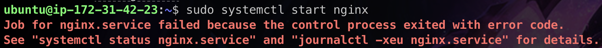
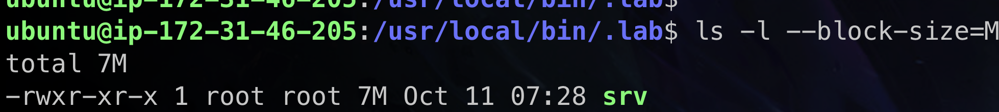

## 作業內容

- 針對 troubleshooting lab 撰寫驗屍報告或 RAC (root cause analysis)
    - 簡易版即可，截圖描述你遇到/看到了什麼問題？做了哪些測試去確認？或是去看了哪些 log？
        - 提供完整步驟、指令、指令執行的結果、看到的 log，包括你怎麼解讀這個結果
    - 完成整份報告後的心得與想法，你的感想是什麼？你收穫了什麼？
- 自行檢查的準則: 其他人是否能透過你的報告，一步一步地完成問題排查與修復，且都能學習到每一步驟是在做什麼。
- 開放小組討論，作業的重點在於「你真的有去動手做過一遍、有去下過那些指令、查看那些 logs」，就算是同學告訴你有這個指令可以用、有那些 log 或資訊可以看，也沒有關係，但希望你們親手做過與親眼看過。 → 但也要注意，為什麼同學知道？你不知道？
    - 真的不要取巧或走捷徑，在學習階段慢就是快，把經驗扎實地累積起來，將來工作上會遇到更多未知的問題，把「方法」跟「過程」學習起來比什麼都重要。

## 驗屍報告

### 環境建立

由於無法讓你在正式環境上直接進行實驗，所以特別製作了 AMI，請你自己重製這個環境進行問題排除。

- region: Tokyo (ap-northeast-1)
- AMI: ami-0ad59b3d0f0e9076f
- instance type: t2.micro
- Network: with Public IP
- security group: Allow SSH & HTTP
- Disk: 8G

建立好 EC2 後，可以 SSH 進去，username 是 ubuntu。

### Start   
首先：執行`curl localhost `         

`sudo systemctl start nginx`    

`sudo systemctl status nginx`       

注意到這兩行：
Nov 08 09:00:23 ip-172-31-42-23 nginx[1431]: 2024/11/08 09:00:23 [emerg] 1431#1431: unexpected ";" in /etc/nginx/nginx.conf:8   
Nov 08 09:00:23 ip-172-31-42-23 nginx[1431]: nginx: configuration file /etc/nginx/nginx.conf test failed    

當前目標：到 /etc/nginx/nginx.conf 修改第八行的分號     

找到

修改權限 以便寫入

修正第8行

在重新執行一次：又出現一個問題

注意到
Nov 08 09:09:20 ip-172-31-42-23 nginx[1515]: nginx: [emerg] bind() to 0.0.0.0:80 failed (98: Address already in use)    
有人佔據了 port 80  

查 如何查詢誰佔用 port 的指令 => `sudo lsof -i:80`    
(其實這個在之前實作時就有用到)   

發現 pid 是 576

刪掉後 pid 重新執行 `sudo kill pid 576` `curl localhost`   

.conf 沒問題    

問了 gpt 說可能是防火牆的問題，使用 `sudo iptables -L -n -v` 檢查，結果發現 port80 被 reject 了   
這一步最跳，目前我還沒發現次問題的線索在哪邊，也或許是看到這個就要想到是不是防火牆的可能性    

重新配置防火牆  

發現 403 Forbidden，查詢後發現是nginx對於文件權限不夠，從sites-enabled/default找到root /var/myweb; 修改權限後成功了！     

### Reboot 後
(這邊主機不一樣是因爲，我 Reboot 點成 terminate 了)

重啟後：
看了佔用的port: 都是srv在搞事，打算把srv的位置找出來刪掉 

查詢srv 在哪

7mb

把 srv與他的 process 刪掉之後，重新 reboot 一次

## 心得     
這次的Troble Shooting Lab 我覺得蠻好玩的，很像在玩解謎遊戲，根據線索一步步解開謎題，在途中也翻了之前寫 week4 的作業，也終於了解為何老師說「一定要自己手動操作一次」，在這次作業也有碰到之前碰過的問題 (Port 佔用)，雖然印象不深，但還是依稀記得自己有解決過他，碰過就是比較印象深刻。

另外，問題是真有一定的線索透露出來，但是就是要有一定的先備知識才能推斷出來，也感謝自己之前有好好的研究了解 nginx 大概在幹嘛，但是「為何這裡可以挑出問題」的敏銳度還不夠，不能馬上從錯誤聯想到可能是哪一邊出錯了，感受到這裡不足的地方。

再來，我發現一開始我在解決問題時有一點畏手畏腳，怕下錯了哪個指令打伺服器搞崩了，但後來同學說反正搞崩在重新再來一個 EC2 就好了 XD ，但這不是一個好的方法，只是在壯膽，真正的在工作時不能搞崩，不過在練習中能搞崩也算好事，了解搞崩的原因後才能知道哪些指令可以做哪些不能做。
